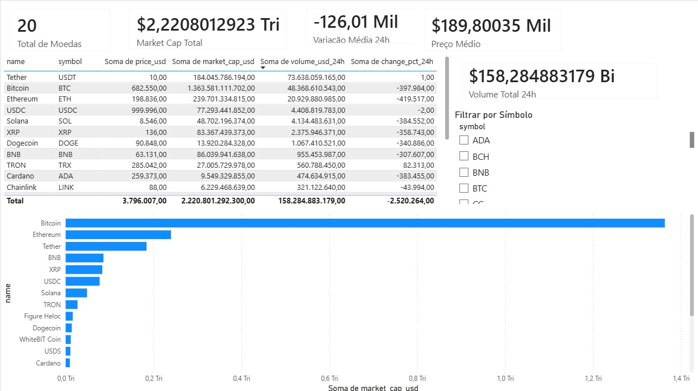

## 📊 Power BI Dashboard

Após o pipeline de ingestão e transformação dos dados em Python, os dados processados foram utilizados para construir um dashboard analítico no Power BI.

### Métricas principais

- Total de criptomoedas
- Market Cap total
- Volume total negociado em 24h
- Preço médio
- Variação média em 24h

### Visualizações

- Top 10 criptomoedas por Market Cap
- Tabela detalhada dos ativos
- Filtro por símbolo

### Preview

